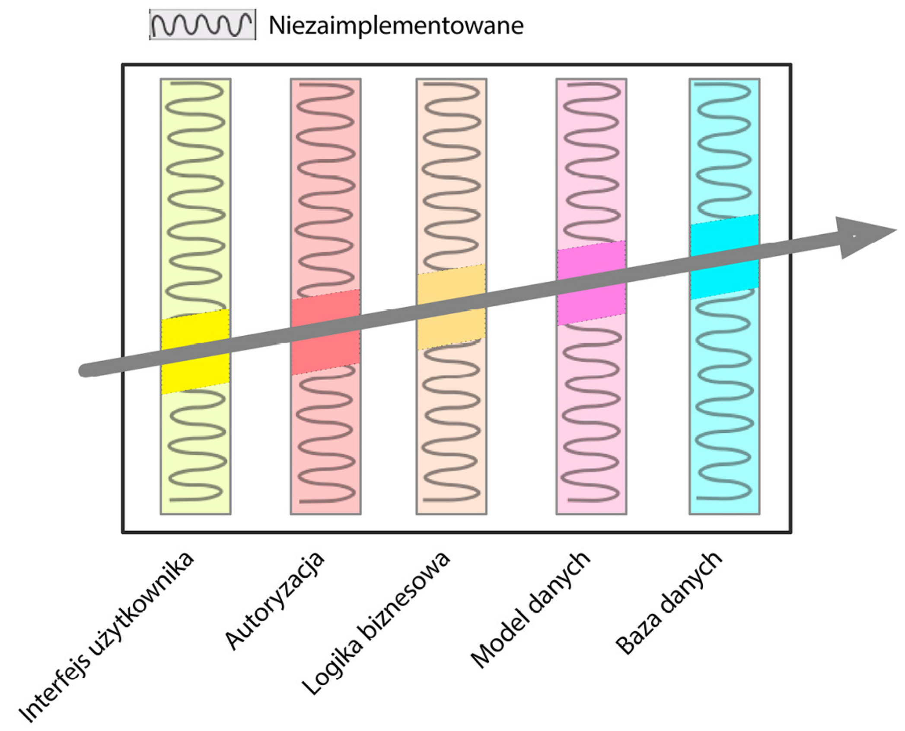

# Pragmatyczny programista. Od czeladnika do mistrza. Wydanie II

Książka jest kierowana do programistów zainteresowanych poprawą swojej efektywności i produktywności.

<!-- TOC -->
* [Pragmatyczny programista. Od czeladnika do mistrza. Wydanie II](#pragmatyczny-programista-od-czeladnika-do-mistrza-wydanie-ii)
    * [Wskazówka nr 1 *Należy dbać o swoje rzemiosło.*](#wskazówka-nr-1-należy-dbać-o-swoje-rzemiosło)
    * [Wskazówka nr 2 *Należy myśleć o tym, co się robi.*](#wskazówka-nr-2-należy-myśleć-o-tym-co-się-robi)
    * [Wskazówka nr 3 *Masz w sobie możliwości sprawcze.*](#wskazówka-nr-3-masz-w-sobie-możliwości-sprawcze)
    * [Wskazówka nr 4 *Proponuj rozwiązania, zamiast posługiwać się kiepskimi wymówkami.*](#wskazówka-nr-4-proponuj-rozwiązania-zamiast-posługiwać-się-kiepskimi-wymówkami)
    * [Wskazówka nr 5 *Nie akceptuj żadnej wybitej szyby.*](#wskazówka-nr-5-nie-akceptuj-żadnej-wybitej-szyby)
    * [Wskazówka nr 6 *Bądź katalizatorem zmian.*](#wskazówka-nr-6-bądź-katalizatorem-zmian)
    * [Wskazówka nr 7 *Pamiętaj o szerszym kontekście.*](#wskazówka-nr-7-pamiętaj-o-szerszym-kontekście)
    * [Wskazówka nr 8 *Jakość powinna być uwzględniona w wymaganiach.*](#wskazówka-nr-8-jakość-powinna-być-uwzględniona-w-wymaganiach)
    * [Wskazówka nr 9 *Regularnie inwestuj w swoje portfolio wiedzy*](#wskazówka-nr-9-regularnie-inwestuj-w-swoje-portfolio-wiedzy)
    * [Wskazówka nr 10 *Patrz krytycznym okiem na to, co czytasz i słyszysz.*](#wskazówka-nr-10-patrz-krytycznym-okiem-na-to-co-czytasz-i-słyszysz)
    * [Wskazówka nr 11 *Język naturalny to po prostu kolejny język programowania.*](#wskazówka-nr-11-język-naturalny-to-po-prostu-kolejny-język-programowania)
    * [Wskazówka nr 12 *Ważne jest nie tylko to, co mówimy, ale też to, jak to mówimy.*](#wskazówka-nr-12-ważne-jest-nie-tylko-to-co-mówimy-ale-też-to-jak-to-mówimy)
    * [Wskazówka nr 13 *Buduj dokumentację wraz z projektem, zamiast ją do niego „przytwierdzać”.*](#wskazówka-nr-13-buduj-dokumentację-wraz-z-projektem-zamiast-ją-do-niego-przytwierdzać)
    * [Wskazówka nr 14 *Dobry projekt jest łatwiejszy do modyfikacji niż zły.*](#wskazówka-nr-14-dobry-projekt-jest-łatwiejszy-do-modyfikacji-niż-zły)
    * [Wskazówka nr 15 *Nie powtarzaj się (ang. Don’t Repeat Yourself — DRY).*](#wskazówka-nr-15-nie-powtarzaj-się-ang-dont-repeat-yourself--dry)
    * [Wskazówka nr 16 *Należy dbać o możliwość wielokrotnego stosowania kodu*](#wskazówka-nr-16-należy-dbać-o-możliwość-wielokrotnego-stosowania-kodu)
    * [Wskazówka nr 17 *Należy eliminować wzajemny wpływ niepowiązanych elementów.*](#wskazówka-nr-17-należy-eliminować-wzajemny-wpływ-niepowiązanych-elementów)
    * [Wskazówka nr 18 *Nie istnieją ostateczne decyzje.*](#wskazówka-nr-18-nie-istnieją-ostateczne-decyzje)
    * [Wskazówka nr 19 *Przewiduj przyszłe trendy.*](#wskazówka-nr-19-przewiduj-przyszłe-trendy)
    * [Wskazówka nr 20 *Należy znajdować cel za pomocą pocisków smugowych.*](#wskazówka-nr-20-należy-znajdować-cel-za-pomocą-pocisków-smugowych)
    * [Wskazówka nr 21 *Prototypy należy tworzyć z myślą o nauce.*](#wskazówka-nr-21-prototypy-należy-tworzyć-z-myślą-o-nauce)
    * [Wskazówka nr 22 *Programuj z zachowaniem ścisłego związku z dziedziną problemu.*](#wskazówka-nr-22-programuj-z-zachowaniem-ścisłego-związku-z-dziedziną-problemu)
    * [Wskazówka nr 23 *Szacowanie pozwala unikać przykrych niespodzianek.*](#wskazówka-nr-23-szacowanie-pozwala-unikać-przykrych-niespodzianek)
    * [Wskazówka nr 24 *Harmonogram i kod powinny powstawać iteracyjnie.*](#wskazówka-nr-24-harmonogram-i-kod-powinny-powstawać-iteracyjnie)
    * [Wskazówka nr 25 *Wiedzę należy zapisywać zwykłym tekstem.*](#wskazówka-nr-25-wiedzę-należy-zapisywać-zwykłym-tekstem)
    * [Wskazówka nr 26 *Należy korzystać z potencjału poleceń powłoki.*](#wskazówka-nr-26-należy-korzystać-z-potencjału-poleceń-powłoki)
    * [Wskazówka nr 27 *Postaraj się o uzyskanie płynności edytora.*](#wskazówka-nr-27-postaraj-się-o-uzyskanie-płynności-edytora)
    * [Wskazówka nr 28 *Zawsze należy stosować system kontroli kodu źródłowego.*](#wskazówka-nr-28-zawsze-należy-stosować-system-kontroli-kodu-źródłowego)
    * [Wskazówka nr 29 *Należy rozwiązywać problemy, nie szukać winowajcy.*](#wskazówka-nr-29-należy-rozwiązywać-problemy-nie-szukać-winowajcy)
    * [Wskazówka nr 30 *Pierwsza zasada debugowania: NIE PANIKUJ!*](#wskazówka-nr-30-pierwsza-zasada-debugowania-nie-panikuj)
    * [Wskazówka nr 31 *Przed naprawieniem kodu napisz test negatywny.*](#wskazówka-nr-31-przed-naprawieniem-kodu-napisz-test-negatywny)
    * [Wskazówka nr 32 *Czytaj komunikaty o błędach.*](#wskazówka-nr-32-czytaj-komunikaty-o-błędach)
    * [Wskazówka nr 33 *Wywołanie select działa.*](#wskazówka-nr-33-wywołanie-select-działa)
    * [Wskazówka nr 34 *Nie należy niczego zakładać — należy to udowodnić.*](#wskazówka-nr-34-nie-należy-niczego-zakładać--należy-to-udowodnić)
    * [Wskazówka nr 35 *Warto opanować jeden język przetwarzania tekstu.*](#wskazówka-nr-35-warto-opanować-jeden-język-przetwarzania-tekstu)
    * [Wskazówka nr 36 *Pisanie doskonałego oprogramowania jest niemożliwe.*](#wskazówka-nr-36-pisanie-doskonałego-oprogramowania-jest-niemożliwe)
    * [Wskazówka nr 37 *Należy projektować z uwzględnieniem kontraktów.*](#wskazówka-nr-37-należy-projektować-z-uwzględnieniem-kontraktów)
    * [Wskazówka nr 38 *Awarie powinny następować możliwie wcześnie.*](#wskazówka-nr-38-awarie-powinny-następować-możliwie-wcześnie)
    * [Wskazówka nr 39 *Jeśli coś nie może się zdarzyć, należy użyć asercji do zagwarantowania, że rzeczywiście się nie zdarzy.*](#wskazówka-nr-39-jeśli-coś-nie-może-się-zdarzyć-należy-użyć-asercji-do-zagwarantowania-że-rzeczywiście-się-nie-zdarzy)
    * [Wskazówka nr 40 *Należy kończyć to, co się zaczyna.*](#wskazówka-nr-40-należy-kończyć-to-co-się-zaczyna)
    * [Wskazówka nr 41 *Korzystaj z lokalnego zasięgu.*](#wskazówka-nr-41-korzystaj-z-lokalnego-zasięgu)
    * [Wskazówka nr 42 *Zawsze poruszaj się małymi krokami.*](#wskazówka-nr-42-zawsze-poruszaj-się-małymi-krokami)
    * [Wskazówka nr 43 *Unikaj wróżenia przyszłości.*](#wskazówka-nr-43-unikaj-wróżenia-przyszłości)
    * [Wskazówka nr 44 *Kod bez sprzężeń jest łatwiejszy do modyfikowania.*](#wskazówka-nr-44-kod-bez-sprzężeń-jest-łatwiejszy-do-modyfikowania)
    * [Wskazówka nr 45 *Mów. Nie pytaj.*](#wskazówka-nr-45-mów-nie-pytaj)
    * [Wskazówka nr 46 *Nie łącz wywołań metod w łańcuchy.*](#wskazówka-nr-46-nie-łącz-wywołań-metod-w-łańcuchy)
    * [Wskazówka nr 47 *Unikaj globalnych danych.*](#wskazówka-nr-47-unikaj-globalnych-danych)
    * [Wskazówka nr 48 *Jeśli jakiś zasób jest na tyle ważny, aby był globalny, opakuj go interfejsem API.*](#wskazówka-nr-48-jeśli-jakiś-zasób-jest-na-tyle-ważny-aby-był-globalny-opakuj-go-interfejsem-api)
    * [Wskazówka nr 49 *Programowanie dotyczy kodu, ale programy dotyczą danych.*](#wskazówka-nr-49-programowanie-dotyczy-kodu-ale-programy-dotyczą-danych)
    * [Wskazówka nr 50 *Nie należy gromadzić stanów, tylko je przekazywać.*](#wskazówka-nr-50-nie-należy-gromadzić-stanów-tylko-je-przekazywać)
    * [Wskazówka nr 51 *Nie płać podatku od dziedziczenia.*](#wskazówka-nr-51-nie-płać-podatku-od-dziedziczenia)
    * [Wskazówka nr 52 *Wykorzystuj interfejsy do wyrażania polimorfizmu.*](#wskazówka-nr-52-wykorzystuj-interfejsy-do-wyrażania-polimorfizmu)
    * [Wskazówka nr 53 *Stosuj delegacje do usług.*](#wskazówka-nr-53-stosuj-delegacje-do-usług)
    * [Wskazówka nr 54 *Korzystaj z domieszek w celu współdzielenia funkcji.*](#wskazówka-nr-54-korzystaj-z-domieszek-w-celu-współdzielenia-funkcji)
    * [Wskazówka nr 55 *Parametryzuj aplikacje korzystając z zewnętrznej konfiguracji*](#wskazówka-nr-55-parametryzuj-aplikacje-korzystając-z-zewnętrznej-konfiguracji)
    * [Wskazówka nr 56 *Warto analizować przepływ pracy, aby na tej podstawie poprawiać współbieżność.*](#wskazówka-nr-56-warto-analizować-przepływ-pracy-aby-na-tej-podstawie-poprawiać-współbieżność)
    * [Wskazówka nr 57 *Współdzielony stan jest zły.*](#wskazówka-nr-57-współdzielony-stan-jest-zły)
    * [Wskazówka nr 58 *Losowe awarie często wynikają z problemów ze współbieżnością.*](#wskazówka-nr-58-losowe-awarie-często-wynikają-z-problemów-ze-współbieżnością)
    * [Wskazówka nr 59 *Do obsługi współbieżności używaj aktorów bez współdzielenia stanu.*](#wskazówka-nr-59-do-obsługi-współbieżności-używaj-aktorów-bez-współdzielenia-stanu)
    * [Wskazówka nr 60 *Korzystaj z systemów typu „czarne tablice” do koordynowania przepływów pracy.*](#wskazówka-nr-60-korzystaj-z-systemów-typu-czarne-tablice-do-koordynowania-przepływów-pracy)
    * [Wskazówka nr 61 *Słuchaj jaszczura, który jest wewnątrz Ciebie.*](#wskazówka-nr-61-słuchaj-jaszczura-który-jest-wewnątrz-ciebie)
    * [Wskazówka nr 62 *Nie należy programować przez koincydencję.*](#wskazówka-nr-62-nie-należy-programować-przez-koincydencję)
    * [Wskazówka nr 63 *Należy szacować rzędy wielkości algorytmów.*](#wskazówka-nr-63-należy-szacować-rzędy-wielkości-algorytmów)
    * [Wskazówka nr 64 *Należy testować swoje szacunki.*](#wskazówka-nr-64-należy-testować-swoje-szacunki)
    * [Wskazówka nr 65 *Refaktoryzację należy przeprowadzać możliwie wcześnie i jak najczęściej.*](#wskazówka-nr-65-refaktoryzację-należy-przeprowadzać-możliwie-wcześnie-i-jak-najczęściej)
    * [Wskazówka nr 66 *W testowaniu nie chodzi o znajdowanie błędów.*](#wskazówka-nr-66-w-testowaniu-nie-chodzi-o-znajdowanie-błędów)
    * [Wskazówka nr 67 *Test jest pierwszym użytkownikiem naszego kodu.*](#wskazówka-nr-67-test-jest-pierwszym-użytkownikiem-naszego-kodu)
    * [Wskazówka nr 68 *Buduj oprogramowanie „od końca do końca”, a nie w stylu góra-dół czy dół-góra.*](#wskazówka-nr-68-buduj-oprogramowanie-od-końca-do-końca-a-nie-w-stylu-góra-dół-czy-dół-góra)
    * [Wskazówka nr 69 *Należy projektować z myślą o testach.*](#wskazówka-nr-69-należy-projektować-z-myślą-o-testach)
    * [Wskazówka nr 70 *Należy testować swoje oprogramowania; w przeciwnym razie zrobią to nasi użytkownicy.*](#wskazówka-nr-70-należy-testować-swoje-oprogramowania-w-przeciwnym-razie-zrobią-to-nasi-użytkownicy)
    * [Wskazówka nr 71 *Do weryfikacji założeń stosuj technikę testowania w oparciu o właściwości.*](#wskazówka-nr-71-do-weryfikacji-założeń-stosuj-technikę-testowania-w-oparciu-o-właściwości)
    * [Wskazówka nr 72 *Zadbaj o prostotę kodu i zminimalizuj obszary ataku.*](#wskazówka-nr-72-zadbaj-o-prostotę-kodu-i-zminimalizuj-obszary-ataku)
    * [Wskazówka nr 73 *Instaluj aktualizacje bezpieczeństwa jak najwcześniej.*](#wskazówka-nr-73-instaluj-aktualizacje-bezpieczeństwa-jak-najwcześniej)
    * [Wskazówka nr 74 *Nadawaj właściwe nazwy i pamiętaj o ich zmienianiu, gdy zajdzie taka potrzeba.*](#wskazówka-nr-74-nadawaj-właściwe-nazwy-i-pamiętaj-o-ich-zmienianiu-gdy-zajdzie-taka-potrzeba)
    * [Wskazówka nr 75 *Nikt dokładnie nie wie, czego chce.*](#wskazówka-nr-75-nikt-dokładnie-nie-wie-czego-chce)
    * [Wskazówka nr 76 *Programiści pomagają użytkownikom zrozumieć, czego użytkownicy chcą.*](#wskazówka-nr-76-programiści-pomagają-użytkownikom-zrozumieć-czego-użytkownicy-chcą)
    * [Wskazówka nr 77 *Wymagania poznajemy w pętli sprzężenia zwrotnego.*](#wskazówka-nr-77-wymagania-poznajemy-w-pętli-sprzężenia-zwrotnego)
    * [Wskazówka nr 78 *Pracuj z użytkownikiem, aby myśleć jak użytkownik.*](#wskazówka-nr-78-pracuj-z-użytkownikiem-aby-myśleć-jak-użytkownik)
    * [Wskazówka nr 79 *Strategia to metadane.*](#wskazówka-nr-79-strategia-to-metadane)
    * [Wskazówka nr 80 *Należy stosować glosariusz projektu.*](#wskazówka-nr-80-należy-stosować-glosariusz-projektu)
    * [Wskazówka nr 81 *Nie należy wykraczać myślami poza schemat — należy raczej znaleźć ten schemat.*](#wskazówka-nr-81-nie-należy-wykraczać-myślami-poza-schemat--należy-raczej-znaleźć-ten-schemat)
    * [Wskazówka nr 82 *Nie staraj się tworzyć kodu w samotności.*](#wskazówka-nr-82-nie-staraj-się-tworzyć-kodu-w-samotności)
    * [Wskazówka nr 83 *Zwinny nie jest rzeczownikiem. Zwinny to sposób, w jaki rozwiązujesz problemy.*](#wskazówka-nr-83-zwinny-nie-jest-rzeczownikiem-zwinny-to-sposób-w-jaki-rozwiązujesz-problemy)
    * [Wskazówka nr 84 *Utrzymuj niewielkie, stabilne zespoły.*](#wskazówka-nr-84-utrzymuj-niewielkie-stabilne-zespoły)
    * [Wskazówka nr 85 *Aby coś się wydarzyło, zaplanuj to.*](#wskazówka-nr-85-aby-coś-się-wydarzyło-zaplanuj-to)
    * [Wskazówka nr 86 *Organizuj w pełni funkcjonalne zespoły.*](#wskazówka-nr-86-organizuj-w-pełni-funkcjonalne-zespoły)
    * [Wskazówka nr 87 *Rób to, co się sprawdza, a nie to, co jest modne.*](#wskazówka-nr-87-rób-to-co-się-sprawdza-a-nie-to-co-jest-modne)
    * [Wskazówka nr 88 *Dostarczaj oprogramowanie wtedy, gdy użytkownicy go potrzebują.*](#wskazówka-nr-88-dostarczaj-oprogramowanie-wtedy-gdy-użytkownicy-go-potrzebują)
    * [Wskazówka nr 89 *Korzystaj z systemu kontroli wersji do zarządzania budowaniem systemu, jego testowaniem i publikowaniem.*](#wskazówka-nr-89-korzystaj-z-systemu-kontroli-wersji-do-zarządzania-budowaniem-systemu-jego-testowaniem-i-publikowaniem)
    * [Wskazówka nr 90 *Należy testować wcześnie. Należy testować często. Należy testować automatycznie.*](#wskazówka-nr-90-należy-testować-wcześnie-należy-testować-często-należy-testować-automatycznie)
    * [Wskazówka nr 91 *Kodowanie nie jest skończone, dopóki nie zostaną wykonane wszystkie testy.*](#wskazówka-nr-91-kodowanie-nie-jest-skończone-dopóki-nie-zostaną-wykonane-wszystkie-testy)
    * [Wskazówka nr 92 *Do testowania testów należy stosować techniki sabotażu.*](#wskazówka-nr-92-do-testowania-testów-należy-stosować-techniki-sabotażu)
    * [Wskazówka nr 93 *Należy testować pokrycie stanów, nie pokrycie kodu.*](#wskazówka-nr-93-należy-testować-pokrycie-stanów-nie-pokrycie-kodu)
    * [Wskazówka nr 94 *Każdy błąd należy znajdować tylko raz.*](#wskazówka-nr-94-każdy-błąd-należy-znajdować-tylko-raz)
    * [Wskazówka nr 95 *Celem programistów powinno być wprawienie użytkowników w zachwyt.*](#wskazówka-nr-95-celem-programistów-powinno-być-wprawienie-użytkowników-w-zachwyt)
    * [Wskazówka nr 96 *Nie ograniczaj się do dostarczania kodu. Staraj się wprawić użytkowników w zachwyt.*](#wskazówka-nr-96-nie-ograniczaj-się-do-dostarczania-kodu-staraj-się-wprawić-użytkowników-w-zachwyt)
    * [Wskazówka nr 97 *Podpisuj efekty swojej pracy.*](#wskazówka-nr-97-podpisuj-efekty-swojej-pracy)
    * [Wskazówka nr 98 *Po pierwsze — nie szkodzić.*](#wskazówka-nr-98-po-pierwsze--nie-szkodzić)
    * [Wskazówka nr 99 *Nie pozwalaj na łajdactwo.*](#wskazówka-nr-99-nie-pozwalaj-na-łajdactwo)
    * [Wskazówka nr 100 To jest Twoje życie.](#wskazówka-nr-100-to-jest-twoje-życie)
<!-- TOC -->

### Wskazówka nr 1 *Należy dbać o swoje rzemiosło.*

Pragmatyczni programiści mają cechy wspólne:

- Szybkie sprawdzanie nowinek, błyskawiczne dostosowywanie warsztatu.
- Dociekliwość-zadają pytania.
- Krytyczne myślenie-rzadko akceptują otrzymywane informacje bez zapoznania się z faktami.
- Realizm-próbują zrozumieć naturę każdego problemu.
- Gotowość do nowych wyzwań-starają się poznawać najróżniejsze technologie i środowiska.

### Wskazówka nr 2 *Należy myśleć o tym, co się robi.*

Tworzenie oprogramowania nie ma najmniejszego sensu, jeśli programista nie dba o jakość swoich produktów.
Warunkiem bycia pragmatycznym programistą jest ustawiczne myślenie o tym, co się robi, przede wszystkim w trakcie tych czynności. Nie chodzi o jednorazowy audyt bieżących praktyk — powinniśmy raczej krytycznie oceniać każdą podejmowaną decyzję w codziennej pracy i podczas wszystkich czynności związanych z wytwarzaniem. Nigdy nie możemy pozwolić sobie na lot z włączonym autopilotem. Musimy stale myśleć i krytycznie oceniać swoją pracę w czasie rzeczywistym.

### Wskazówka nr 3 *Masz w sobie możliwości sprawcze.*

Pragmatyczny programista bierze we własne ręce losy swojej kariery i nie boi się przyznać do braku wiedzy czy
popełnionego błędu.

### Wskazówka nr 4 *Proponuj rozwiązania, zamiast posługiwać się kiepskimi wymówkami.*

Jeśli bierzemy na siebie odpowiedzialność za efekt podejmowanych działań, musimy być przygotowani na wszelkie konsekwencje. W razie popełnienia błędu (a wszyscy je popełniamy) lub błędnej oceny sytuacji musimy uczciwie przyznać się do porażki i zaproponować rozwiązanie. Nie należy winić za własne niedociągnięcia współpracowników ani innych czynników.

### Wskazówka nr 5 *Nie akceptuj żadnej wybitej szyby.*

Nie należy pozostawiać nienaprawionej żadnej wybitej szyby (złego projektu, niewłaściwej decyzji, kiepskiego kodu itp.). Każdą taką „szybę” należy wymienić zaraz po odkryciu problemu. Jeśli brakuje czasu na wstawienie nowej szyby, należy wstawić w jej miejsce choćby dyktę.

### Wskazówka nr 6 *Bądź katalizatorem zmian.*

Wielu ludziom łatwiej przychodzi dołączanie do udanego projektu niż praca na niepewny sukces od podstaw. Warto więc tak opisać perspektywy projektu, aby byli przekonani o jego świetlanej przyszłości5.

### Wskazówka nr 7 *Pamiętaj o szerszym kontekście.*

Powinniśmy stale obserwować to, co dzieje się w otaczającym nas świecie, zamiast koncentrować się tylko na swoich zadaniach.

### Wskazówka nr 8 *Jakość powinna być uwzględniona w wymaganiach.*

Zakres i jakość tworzonego systemu powinny być precyzyjnie określone w wymaganiach tego systemu.
Nie należy niszczyć dobrego programu przesadną liczbą upiększeń i wyrafinowanych dodatków.

### Wskazówka nr 9 *Regularnie inwestuj w swoje portfolio wiedzy*

Musimy inwestować w swoje portfolio wiedzy możliwie regularnie.

- Różnorodność. Im więcej różnych zagadnień znamy, tym większa jest nasza wartość. Absolutnym minimum jest znajomość podstawowych cech technologii, której aktualnie używamy w swojej pracy. Nie możemy jednak na tym poprzestać.
- Zarządzanie ryzykiem. Z technologiami wiążą się bardzo różne czynniki ryzyka — istnieją zarówno technologie cechujące się dużym zyskiem przy małym ryzyku, jak i rozwiązania oferujące stosunkowo niewiele w warunkach wysokiego ryzyka.
- *Kupuj tanio, sprzedawaj drogo.* Nauka nowych technologii jeszcze przed zyskaniem większej popularności bywa równie trudna, jak odnajdywanie niedoszacowanych papierów wartościowych, jednak potencjalna nagroda w obu przypadkach będzie bardzo kusząca.
- Przeglądy i korekty. Mamy do czynienia z branżą podlegającą wyjątkowo dynamicznym zmianom. Popularna technologia, której używamy zaledwie od miesiąca, już jutro może okazać się całkowitym przeżytkiem

Cele:
- Warto uczyć się przynajmniej jednego nowego języka rocznie.
- Należy czytać jedną książkę techniczną na miesiąc.
- Powinniśmy też sięgać po książki inne niż techniczne.
- Powinniśmy brać udział w szkoleniach.
- Należy zaangażować się w funkcjonowanie lokalnych grup użytkowników.
- Należy eksperymentować z różnymi środowiskami.
- Należy trzymać rękę na pulsie. Warto czytać artykuły i posty online dotyczące technologii innych niż te, których używasz w swoim bieżącym projekcie. 
- Należy wystrzegać się fanatyków dogmatycznie przywiązanych do swoich racji — ich poglądy mogą, ale nie muszą potwierdzić się w naszym przypadku.

### Wskazówka nr 10 *Patrz krytycznym okiem na to, co czytasz i słyszysz.*

Nigdy nie powinniśmy lekceważyć siły komercjalizacji.
Musimy mieć pewność, że wiedza, która trafia do naszego portfolio, jest prawidłowa i nie została zniekształcona przez marketingowy przekaz producenta czy mediów.

### Wskazówka nr 11 *Język naturalny to po prostu kolejny język programowania.*

Ponieważ znaczną część czasu pracy poświęcamy właśnie na komunikację, musimy robić to naprawdę dobrze.

Traktuj angielski (lub dowolny język naturalny, którym się posługujesz) jak specjalny język programowania. Pisz w języku naturalnym tak, jak pisze się kod, stosuj zasady DRY, ETC, narzędzia automatyzacji.

### Wskazówka nr 12 *Ważne jest nie tylko to, co mówimy, ale też to, jak to mówimy.*

Ogólne zalecenia:
- Musimy zaplanować, co chcemy powiedzieć.
- Należy wybrać właściwy moment.
- Należy wybrać odpowiedni styl.
- Należy wiedzieć coś o rozmówcach.
- Należy zadbać o warstwę estetyczną.
- Należy słuchać innych
- Należy zaangażować odbiorców. 

Wskazówki dotyczące poczty elektronicznej:
- Należy przeczytać tekst przed kliknięciem przycisku Wyślij.
- Należy sprawdzić pisownię.
- Należy zachować prosty format.
- Należy ograniczać liczbę cytatów. Jeśli już cytujemy cudzą wiadomość poczty elektronicznej, koniecznie powinniśmy odpowiednio wyróżnić cytat i umieścić go w tekście (nie w załączniku). 
- Nie należy przeklinać; w przeciwnym razie nasze przekleństwa będą nas jeszcze długo prześladowały.
- Przed wysłaniem wiadomości warto jeszcze raz sprawdzić listę adresatów.

### Wskazówka nr 13 *Buduj dokumentację wraz z projektem, zamiast ją do niego „przytwierdzać”.*

Pragmatyczni programiści uwzględniają dokumentację jako integralną część całego cyklu życia projektu. Jej pisanie można ułatwić. Nie trzeba powielać pracy lub marnować czasu. Dokumentacja może być cały czas pod ręką — w kodzie źródłowym.

Dobrze wyglądającą dokumentację można łatwo stworzyć na podstawie komentarzy w kodzie źródłowym. Zachęcamy do dodawania komentarzy do modułów i eksportowanych funkcji, aby ułatwić innym programistom korzystanie z naszego kodu.

Nie oznacza to jednak, że zgadzamy się z osobami, które mówią, że każda funkcja, struktura danych, deklaracja typu itp., potrzebuje osobnego komentarza.

### Wskazówka nr 14 *Dobry projekt jest łatwiejszy do modyfikacji niż zły.*

Każdy wycinek wiedzy musi mieć dokładnie jedną, jednoznaczną i oficjalną reprezentację w ramach systemu.

### Wskazówka nr 15 *Nie powtarzaj się (ang. Don’t Repeat Yourself — DRY).*

Kiedy jakiś pojedynczy aspekt kodu musi się zmienić, musisz uwzględnić tę zmianę w wielu miejscach oraz w wielu
różnych formatach?

Nie każde powielenie kodu jest powieleniem wiedzy

Na późniejszych etapach procesu wytwarzania oprogramowania możemy świadomie podjąć decyzję o naruszeniu zasady DRY z myślą o poprawie wydajności.

### Wskazówka nr 16 *Należy dbać o możliwość wielokrotnego stosowania kodu*

*Ortogonalność* to pojęcie zaczerpnięte z geometrii. W świecie komputerów interesujący nas termin oznacza rodzaj niezależności lub izolacji. Mówimy, że co najmniej dwa elementy są ortogonalne, jeśli zmiana jednego z nich nie wpływa na pozostałe.

W dobrze zaprojektowanym systemie kod bazy danych jest ortogonalny względem interfejsu użytkownika — oznacza to, że możemy zmienić ten interfejs bez wpływu na bazę danych oraz wymienić system bazy danych na inny bez wpływu na interfejs.

### Wskazówka nr 17 *Należy eliminować wzajemny wpływ niepowiązanych elementów.*

- Nie powinniśmy uzależniać naszego systemu od właściwości, na które nie mamy wpływu.
- Należy dbać o izolację kodu. Powinniśmy pisać skromny kod, czyli moduły, które bez potrzeby nie udostępniają wszystkich swoich funkcji pozostałym modułom, ale też przesadnie nie korzystają z implementacji innych modułów.
- Należy unikać danych globalnych.
- Należy unikać podobnych funkcji.

### Wskazówka nr 18 *Nie istnieją ostateczne decyzje.*

Jeśli zbyt mocno uzależniamy działanie naszego systemu od jakiegoś warunku, możemy być niemal pewni, że warunek ten ulegnie zmianie.

### Wskazówka nr 19 *Przewiduj przyszłe trendy.*

Szukaj ważnych wymagań — takich, które definiują system. Szukaj obszarów, co do których masz wątpliwości oraz takich, dla których dostrzegasz największe zagrożenia. Następnie ustal priorytety w programowaniu tak, aby tymi obszarami zająć się najpierw.

### Wskazówka nr 20 *Należy znajdować cel za pomocą pocisków smugowych.*

### Wskazówka nr 21 *Prototypy należy tworzyć z myślą o nauce.*

Przedmiotem prototypu mogą być: architektura; nowe funkcje w istniejącym systemie; struktura lub treść danych zewnętrznych; narzędzia lub komponenty zewnętrznych producentów; problemy związane z wydajnością; projekt interfejsu użytkownika.

Tworzenie i badanie prototypów jest typowym procesem uczenia się. Wartość prototypu nie leży w jego kodzie, tylko we wnioskach, które sformułowaliśmy na jego podstawie. Właśnie te wnioski są istotą idei posługiwania się prototypami.

Co można zignorować podczas konstruowania prototypu:
- Poprawność. W pewnych sytuacjach można z powodzeniem posługiwać się nieprawidłowymi, wręcz głupimi danymi.
- Kompletność. Prototyp może obejmować swoim działaniem bardzo ograniczony aspekt funkcjonowania docelowego produktu, być może tylko wybrany wcześniej zestaw danych wejściowych i jeden element menu.
- Niezawodność. Mechanizm sprawdzania błędów może być niekompletny lub w ogóle może nie istnieć. W razie zboczenia z ustalonej wcześniej ścieżki prototyp może bez żadnych konsekwencji ulec awarii i spłonąć, dając przy
okazji wspaniały pokaz fajerwerków.
- Styl. Kod prototypu w większości przypadków nie wymaga komentarzy ani dokumentacji (choć w wyniku doświadczeń przeprowadzonych z użyciem prototypu można opracować całe sterty dokumentów).

Obszary, w których warto rozważyć opracowanie prototypu architektury:
- Czy zakres odpowiedzialności najważniejszych komponentów jest dobrze zdefiniowany i przemyślany?
- Czy odpowiednio precyzyjnie zdefiniowano zasady współpracy głównych komponentów?-
- Czy udało się zminimalizować zjawisko powiązań?
- Czy potrafimy zidentyfikować potencjalne źródła powielania?
- Czy definicje i ograniczenia interfejsu są możliwe do zaakceptowania?
- Czy każdy moduł dysponuje ścieżką dostępu do danych niezbędnych w czasie wykonywania?
- Czy ma dostęp do tych danych w czasie, gdy ich potrzebuje?

### Wskazówka nr 22 *Programuj z zachowaniem ścisłego związku z dziedziną problemu.*

Jednym z powodów, dla których nie sprawdza się klasyczny model: zbieranie wymagań, projektowanie, kodowanie, wdrażanie jest to, że model ten bazuje na założeniu, że wiemy, jakie są wymagania. Jednak w praktyce rzadko tak jest. Użytkownicy biznesowi mają mgliste pojęcie o tym, co chcą osiągnąć, ale nie znają szczegółów ani się nimi nie przejmują.

### Wskazówka nr 23 *Szacowanie pozwala unikać przykrych niespodzianek.*

Jeśli po przeprowadzeniu wszystkich niezbędnych analiz stwierdzamy, że jakiś projekt zajmie 125 dni roboczych (25 tygodni), być może warto oszacować ten czas jako „około sześć miesięcy”. To samo dotyczy szacunków każdej innej wielkości — zawsze powinniśmy wybierać jednostki dobrze odzwierciedlające precyzję, którą chcemy zakomunikować odbiorcy.

### Wskazówka nr 24 *Harmonogram i kod powinny powstawać iteracyjnie.*

Proponowane rozwiązanie nie jest zbyt popularne wśród menedżerów, którzy zwykle oczekują pojedynczej, precyzyjnej liczby jeszcze przed przystąpieniem do realizacji projektu.

### Wskazówka nr 25 *Wiedzę należy zapisywać zwykłym tekstem.*

Korzyści stosowania zwykłego tekstu:
- Trwałe bezpieczeństwo zamiast starzenia się.
- Szerokie możliwości stosowania.
- Łatwiejsze testowanie.

### Wskazówka nr 26 *Należy korzystać z potencjału poleceń powłoki.*

Wystarczy dobrze opanować umiejętność korzystania z powłoki, a błyskawicznie zauważymy wzrost produktywności.

### Wskazówka nr 27 *Postaraj się o uzyskanie płynności edytora.*

Największy zysk z zapewnienia płynności edytora polega na tym, że gdy uda Ci się ją osiągnąć, nie będziesz zmuszony myśleć o mechanice edycji. Dystans pomiędzy chwilą, gdy o czymś pomyślisz, a momentem, kiedy to znajdzie się w buforze edytora, znacznie się skróci.

Co wpływa na „płynność” edytora? Oto lista cech:
- Możliwość zaznaczania w tekście pojedynczych znaków, słów, wierszy i akapitów.
- Poruszanie się po kodzie z wykorzystaniem różnych jednostek składniowych (pasujących separatorów, funkcji, modułów).
- Modyfikowanie wcięć w kodzie po wprowadzeniu zmian.
- Komentowanie bloków kodu i usuwanie znaczników komentarza za pomocą jednego polecenia.
- Cofanie zmian i powtarzanie wykonanych operacji.
- Podział okna edytora na kilka paneli i poruszanie się pomiędzy nimi.
- Przechodzenie do wiersza o określonym numerze.
- Sortowanie zaznaczonych wierszy.
- Wyszukiwanie zarówno ciągów znaków, jak i wyrażeń regularnych, oraz powtarzanie poprzednich operacji wyszukiwania.
- Tymczasowe utworzenie wielu kursorów na podstawie zaznaczenia lub dopasowania wzorców i równoległe edytowanie zawartego w nich tekstu.
- Wyświetlanie błędów kompilacji w bieżącym projekcie.
- Uruchamianie testów w bieżącym projekcie.

Czy możesz wykonać wyżej wymienione działania bez użycia myszki (trackpada)?

Być może Twój obecny edytor nie pozwala na wykonanie niektórych z tych operacji. A może nadszedł czas, by go zmienić?

### Wskazówka nr 28 *Zawsze należy stosować system kontroli kodu źródłowego.*

Kontroli kodu źródłowego powinno podlegać dosłownie wszystko — dokumentacja, listy numerów telefonów, notatki dla producentów, pliki Makefile, procedury kompilacji i wydań, a nawet prosty skrypt odpowiedzialny za porządkowanie logów — słowem, wszystko.

### Wskazówka nr 29 *Należy rozwiązywać problemy, nie szukać winowajcy.*

Nie ma większego znaczenia to, czy błąd wynika z naszego przeoczenia, czy jest spowodowany cudzym niedopatrzeniem. To wciąż nasz problem.

### Wskazówka nr 30 *Pierwsza zasada debugowania: NIE PANIKUJ!*

Nietrudno o panikę, szczególnie jeśli stoimy w obliczu trudnych do dotrzymania terminów bądź jeśli w czasie poszukiwania przyczyny błędu stoi nad nami zdenerwowany szef lub klient.

### Wskazówka nr 31 *Przed naprawieniem kodu napisz test negatywny.*

Czasami zmuszenie się do wyizolowania okoliczności, które prowadzą do błędu, może dać nam wskazówkę, w jaki sposób można go naprawić. Na rozwiązanie naprowadza nas proces pisania testu.

### Wskazówka nr 32 *Czytaj komunikaty o błędach.*

Przemawianie do gumowej kaczki Jedną z najprostszych, a jednocześnie wyjątkowo przydatną techniką odnajdywania przyczyny problemu jest zwykłe wyjaśnianie badanego aspektu komuś innemu. Druga osoba powinna stale patrzeć na monitor przez ramię programisty i potakiwać głową (tak jak gumowa kaczka kołysze się na wodzie w wannie). Nie musi wypowiadać choćby jednego słowa. Chodzi raczej o wyjaśnianie jej krok po kroku, co analizowany kod powinien robić — okazuje się, że w ten sposób zadziwiająco często można odkrywać źródła problemów.

### Wskazówka nr 33 *Wywołanie select działa.*

*Pracowaliśmy kiedyś nad projektem, w którym starszy inżynier był przekonany o błędnym działaniu wywołania systemowego select w systemie Unix. Żadne techniki perswazji ani logicznego tłumaczenia nie mogły zmienić tego przekonania (to, że we wszystkich innych aplikacjach sieciowych wspomniane wywołanie działało bez zarzutu, nie miało żadnego znaczenia). Całymi tygodniami pisał kod, który miał obejść „wadliwe” wywołanie, ale z jakiegoś powodu nie udawało mu się wyeliminować problemu. Kiedy wreszcie został zmuszony do zapoznania się z dokumentacją wywołania select, szybko odkrył problem i w parę minut usunął usterkę. Od tej pory używamy zdania „select nie działa” do delikatnego zwracania uwagi na każdą próbę zrzucania odpowiedzialności za błąd na system w sytuacji, gdy bardziej prawdopodobna jest pomyłka we własnym kodzie.* 

### Wskazówka nr 34 *Nie należy niczego zakładać — należy to udowodnić.*

Nie wolno nam pomijać w testach żadnej procedury czy fragmentu kodu tylko dlatego, że „jesteśmy pewni” jego prawidłowego działania. Powinniśmy raczej dowieść prawidłowości kodu. Musimy udowodnić jego poprawność w określonym kontekście, z bieżącymi danymi i w określonych warunkach granicznych. 

Kiedy natrafiamy na zaskakujący błąd, oprócz jego zwykłego usunięcia musimy podjąć próbę określenia, dlaczego usterka nie została wykryta wcześniej. Należy zastanowić się, czy nie należałoby poprawić testów jednostkowych lub innych testów, tak aby w przyszłości wykrywały podobne błędy.

### Wskazówka nr 35 *Warto opanować jeden język przetwarzania tekstu.*

Pragmatyczni programiści pracują z tekstem tak samo, jak stolarze kształtują drewno. W dotychczasowych podrozdziałach omawialiśmy konkretne narzędzia używane przez programistów: powłoki, edytory i debugery. Wspomniane narzędzia mają swoje odpowiedniki w warsztacie stolarskim: dłuta, piły i heble, czyli narzędzia stworzone z myślą o jednej czy dwóch czynnościach. Jednak co jakiś czas musimy podejmować działania, których nie da się łatwo realizować za pomocą podstawowego zestawu narzędzi. Potrzebujemy więc uniwersalnego narzędzia do pracy z tekstem.

### Wskazówka nr 36 *Pisanie doskonałego oprogramowania jest niemożliwe.*

Czy to bolało? Nie powinno. Należy się z tym pogodzić jako z jednym z aksjomatów. Każde oprogramowanie staje się przestarzałe niemal natychmiast po napisaniu.

### Wskazówka nr 37 *Należy projektować z uwzględnieniem kontraktów.*

Należy precyzyjnie określić, co będzie akceptowane na początku, i obiecać możliwie niewiele na wyjściu.

### Wskazówka nr 38 *Awarie powinny następować możliwie wcześnie.*

Można, oczywiście, wmawiać sobie, że błąd nie mógł mieć miejsca, i dalej ignorować zagrożenie. Pragmatyczni programiści postępują jednak inaczej — powtarzają sobie, że skoro wystąpił błąd, musiało zdarzyć się coś bardzo, bardzo złego.

### Wskazówka nr 39 *Jeśli coś nie może się zdarzyć, należy użyć asercji do zagwarantowania, że rzeczywiście się nie zdarzy.*

Asercji nie należy używać zamiast właściwych mechanizmów obsługi błędów. Asercja służą do sprawdzania zdarzeń, które nigdy nie powinny mieć miejsca

Pozostaw asercje włączone Istnieje dość powszechna, całkowicie błędna opinia na temat asercji. Brzmi ona mniej więcej tak: Asercje stanowią pewne dodatkowe obciążenie dla kodu. Ponieważ sprawdzają zjawiska, które nigdy nie powinny mieć miejsca, są wyzwalane tylko przez błędy w kodzie. W tej sytuacji po przetestowaniu i dostarczeniu kodu asercje stają się niepotrzebne i jako takie powinny być wyłączone, aby przyspieszyć działanie kodu. Asercje to w istocie mechanizmy debugowania kodu.

### Wskazówka nr 40 *Należy kończyć to, co się zaczyna.*

Wielu programistów nie postępuje jednak według spójnego planu przydzielania i późniejszego zwalniania zasobów.
W przypadku wątpliwości zawsze opłaca się ograniczyć zakres.

### Wskazówka nr 41 *Korzystaj z lokalnego zasięgu.*

Należy zwalniać zasoby w kolejności odwrotnej, niż są przydzielane. W ten sposób unikniemy zjawiska osieroconych zasobów, jeśli jeden zasób zawiera odwołania do innego. W przypadku przydzielania tego samego zbioru zasobów w różnych miejscach kodu zawsze należy przydzielać w tej samej kolejności.

### Wskazówka nr 42 *Zawsze poruszaj się małymi krokami.*

Zawsze należy robić małe, przemyślane kroki, a przed podjęciem kolejnych sprawdzać informacje zwrotne i odpowiednio dostosowywać swoje działania. Tak samo, jak reflektory samochodu mają ograniczony rzut, tak my możemy przewidywać przyszłość tylko o jeden bądź dwa kroki — być może tylko kilka godzin lub dni naprzód. Poza tym punktem łatwo możemy przejść od uzasadnionej wiedzą prognozy do dzikiej spekulacji.

### Wskazówka nr 43 *Unikaj wróżenia przyszłości.*

W większości przypadków jutro bardzo przypomina dzisiaj. Nie należy jednak na to liczyć.

### Wskazówka nr 44 *Kod bez sprzężeń jest łatwiejszy do modyfikowania.*

Sprzężenia są wrogiem zmian, ponieważ wiążą ze sobą elementy, które muszą być zmieniane równolegle. To sprawia, że wprowadzanie zmian staje się trudniejsze: albo trzeba poświęcić czas na znalezienie wszystkich modułów, które wymagają zmian, albo na zastanawianie się, dlaczego niektóre komponenty przestały działać, skoro zmieniliśmy „tylko jedną rzecz”, a nie zmienialiśmy innych elementów.

W praktyce wszystko, co jest w aplikacji, należy rozważać jako możliwe do zmiany. Wszystko, co znajduje się w  zewnętrznych bibliotekach, należy uznawać za ulotne — zwłaszcza wtedy, gdy dostawcy biblioteki często zmieniają API pomiędzy kolejnymi wersjami. Z kolei biblioteki standardowe dostarczane wraz z językiem można uznać za dość stabilne.

### Wskazówka nr 45 *Mów. Nie pytaj.*

Powyższa zasada mówi, że nie należy podejmować decyzji w oparciu o wewnętrzny stan obiektu, a następnie aktualizować ten obiekt.

### Wskazówka nr 46 *Nie łącz wywołań metod w łańcuchy.*

Gdy chcesz uzyskać dostęp do czegoś, staraj się nie korzystać z więcej niż jednej kropki.

### Wskazówka nr 47 *Unikaj globalnych danych.*

Jeśli masz w aplikacji singleton zawierający zbiór zmiennych egzemplarza, to nadal są to dane globalne.

Każdy element globalnych danych działa tak, jakby do każdej metody w aplikacji nagle został wprowadzony dodatkowy parametr.

Zło globalizacji Dane dostępne globalnie to podstępne źródło sprzężeń pomiędzy komponentami aplikacji. Każdy element globalnych danych działa tak, jakby do każdej metody w aplikacji nagle został wprowadzony dodatkowy parametr

Jeśli Twój kod wykorzystuje dane globalne, to oddzielenie jednego modułu od reszty staje się trudne.

Problem ten jest widoczny podczas pisania testów jednostkowych kodu, który korzysta z danych globalnych. W takiej sytuacji tylko po to, aby uruchomić test, trzeba napisać mnóstwo kodu odpowiedzialnego za skonfigurowanie globalnego środowiska.

### Wskazówka nr 48 *Jeśli jakiś zasób jest na tyle ważny, aby był globalny, opakuj go interfejsem API.*

### Wskazówka nr 49 *Programowanie dotyczy kodu, ale programy dotyczą danych.*

Kiedy myślimy o projekcie, rzadko uwzględniamy tworzenie transformacji. Zamiast tego martwimy się o klasy i moduły, struktury danych i algorytmy, języki i frameworki. Uważamy, że ta koncentracja na kodzie sprawia, że gubimy sedno problemu: musimy wrócić do myślenia o programach jako

Program przypomina przemysłową linię produkcyjną: wprowadzamy surowe dane na jednym końcu, a z drugiej strony wychodzi gotowy produkt (informacje). Warto myśleć w ten sposób o każdym kodzie.

### Wskazówka nr 50 *Nie należy gromadzić stanów, tylko je przekazywać.*

Cztery strategie, które mogą nam pomóc w pisaniu aplikacji obsługujących zdarzenia:
- Maszyna stanów skończonych.
- Wzorzec Obserwator.
- Publikowanie i subskrypcje.
- Programowanie reaktywne i strumienie.

Maszyny stanów są niedostatecznie często wykorzystywane przez programistów. Trzeba jednak pamiętać, że zastosowanie maszyn stanów nie rozwiąże wszystkich problemów związanych ze zdarzeniami.

**We wzorcu projektowym Obserwator** mamy źródło zdarzeń zwane obiektem obserwowalnym oraz listę klientów — obserwatorów, zainteresowanych tymi zdarzeniami. Jednak z wzorcem Obserwator związany jest pewien problem: konieczność, aby każdy obserwator zarejestrował się w obiekcie obserwowalnym,

**Wzorzec publikuj – subskrybuj** (pubsub) uogólnia wzorzec Obserwator, a jednocześnie rozwiązuje problemy sprzężeń i wydajności. W modelu pubsub mamy wydawców i subskrybentów. Są ze sobą powiązani za pomocą kanałów. Kanały są zaimplementowane w odrębnym kodzie — czasami jest to biblioteka, czasami proces, a czasami infrastruktura rozproszona. Wszystkie te szczegóły implementacji nie są widoczne z kodu.  Minusem jest to, że w systemie, który intensywnie korzysta z techniki pubsub, może być trudne zaobserwowanie co się dzieje: nie da się spojrzeć w kod wydawcy i natychmiast zobaczyć subskrybentów, którzy są zainteresowani określonym komunikatem.

W takich przypadkach możemy skorzystać ze **strumieni**. Strumienie pozwalają traktować zdarzenia tak, jakby były zbiorem danych. Mechanizm działa tak, jakbyśmy mieli listę zdarzeń, która wydłuża się wraz z napływem nowych zdarzeń. Elegancja takiego rozwiązania polega na tym, że możemy traktować strumienie podobnie, jak wszystkie inne kolekcje: możemy je przetwarzać, scalać, filtrować oraz wykonywać wszystkie inne dobrze znane operacje typowe dla kolekcji danych. Możemy nawet łączyć strumienie zdarzeń ze zwykłymi kolekcjami. Do tego strumienie mogą być asynchroniczne, co oznacza, że kod może reagować na zdarzenia w miarę ich napływu.

### Wskazówka nr 51 *Nie płać podatku od dziedziczenia.*

Trzy techniki, dzięki którym nigdy nie będziecie potrzebowali używać dziedziczenia:
- Interfejsy i protokoły.
- Delegacje.
- Domieszki (ang. mixins) i cechy (ang. traits).

### Wskazówka nr 52 *Wykorzystuj interfejsy do wyrażania polimorfizmu.*

Interfejsy i protokoły pozwalają korzystać z polimorfizmu bez dziedziczenia.

### Wskazówka nr 53 *Stosuj delegacje do usług.*

Relacja has-a ma przewagę nad relacją is-a.

### Wskazówka nr 54 *Korzystaj z domieszek w celu współdzielenia funkcji.*

Podstawowa idea jest prosta: chcemy mieć możliwość rozszerzania klas i obiektów o nowe funkcje bez użycia dziedziczenia. W związku z tym tworzymy zbiór tych funkcji, nadajemy temu zbiorowi nazwę, a następnie w jakiś sposób rozszerzamy za ich pomocą klasę lub obiekt. W tym momencie utworzyliśmy nową klasę lub obiekt, które łączą w sobie możliwości oryginału i wszystkich jego domieszek. W większości przypadków będziemy w stanie tworzyć takie rozszerzenia, nawet jeśli nie mamy dostępu do kodu źródłowego rozszerzanej klasy.

### Wskazówka nr 55 *Parametryzuj aplikacje korzystając z zewnętrznej konfiguracji*

Do danych, które zazwyczaj umieszczamy w konfiguracji, należą:

- Poświadczenia do zewnętrznych usług (bazy danych, zewnętrznych API, itp.).
- Poziomy logowania i miejsca docelowe.
- Port, adres IP, nazwa komputera oraz nazwy klastrów wykorzystywane przez aplikację.
- Parametry walidacji specyficzne dla środowiska.
- Zbiory zewnętrznych parametrów, na przykład stawki podatkowe.
- Szczegóły formatowania specyficzne dla lokalizacji.
- Klucze licencyjne.

Ogólnie rzecz biorąc, poszukaj wszystkiego, o czym wiesz, że będzie musiało się zmieniać, a co można wyrazić na zewnątrz głównej treści kodu, i umieść to w zestawie konfiguracyjnym.

### Wskazówka nr 56 *Warto analizować przepływ pracy, aby na tej podstawie poprawiać współbieżność.*

Przypomnijmy różnicę: współbieżność jest mechanizmem programowym, natomiast przetwarzanie równoległe dotyczy sprzętu.

### Wskazówka nr 57 *Współdzielony stan jest zły.*

### Wskazówka nr 58 *Losowe awarie często wynikają z problemów ze współbieżnością.*

### Wskazówka nr 59 *Do obsługi współbieżności używaj aktorów bez współdzielenia stanu.*

Aktor to niezależny, wirtualny procesor z własnym lokalnym (i prywatnym) stanem. Każdy aktor ma swoją skrzynkę pocztową. Gdy w skrzynce pocztowej pojawi się wiadomość, a aktor jest w stanie spoczynku, uaktywnia się i ją przetwarza. Proces jest zazwyczaj bardziej ogólnym wirtualnym procesorem, często implementowanym w systemie operacyjnym w celu ułatwienia współbieżności.

### Wskazówka nr 60 *Korzystaj z systemów typu „czarne tablice” do koordynowania przepływów pracy.*

*Eleganckim rozwiązaniem trudności, jakie tu występują, jest zastosowanie systemu typu „czarna tablica” łącznie z silnikiem przetwarzania reguł. Kolejność napływu danych jest bez znaczenia: opublikowanie faktu może inicjować odpowiednie reguły. Można również w łatwy sposób obsługiwać sprzężenia zwrotne: wyjście z dowolnego zestawu reguł może być publikowane na tablicy i powodować zadziałanie kolejnych reguł.*

### Wskazówka nr 61 *Słuchaj jaszczura, który jest wewnątrz Ciebie.*

*Po pierwsze przestań robić to, co robisz. Daj sobie trochę czasu i miejsca, aby pozwolić Twojemu mózgowi się zorganizować. Przestań myśleć o kodzie i przez jakiś czas zacznij robić coś, co nie wymaga zbyt wiele myślenia, z dala od klawiatury. Pójdź na spacer, wyjdź na obiad, porozmawiaj z kimś. Być może się prześpij. Pozwól, by pomysły same przeniknęły przez warstwy Twojego mózgu: nie możesz tego wymusić. W końcu, jak bańka z powietrzem, zdołają przedostać się do Twojej świadomości, a Ty przeżyjesz jeden ze słynnych momentów aha!*

*Jeśli to nie zadziała, spróbuj uzewnętrznić problem. Zacznij bazgrać na kartce o kodzie, który piszesz, albo opowiedz o nim współpracownikowi (najlepiej takiemu, który nie jest programistą), albo po prostu gadaj do swojej gumowej kaczki. Przedstaw problem, który starasz się rozwiązać, różnym częściom Twojego mózgu i sprawdź, czy któraś z nich ma lepszy sposób na jego rozwiązanie. Niezliczoną liczbę razy zdarzało się nam, że jeden z nas wyjaśniając problem drugiemu, nagle wykrzyknął „No tak! Przecież to oczywiste!”. Po czym rozwiązał problem, który go dręczył.*

### Wskazówka nr 62 *Nie należy programować przez koincydencję.*

- Zawsze należy wiedzieć, co się robi.
- Nie należy kodować po omacku. Próba budowy aplikacji, której do końca nie rozumiemy, lub użycia technologii, której dobrze nie znamy, jest jak zaproszenie do nieporozumień wynikających z przypadkowych zbiegów okoliczności.
- Należy postępować według planu niezależnie od tego, czy jest to plan w naszej głowie, zapisany na serwetce lub na białej tablicy.
- Należy opierać się na tym, co niezawodne. Nie powinniśmy uzależniać naszych rozwiązań od przypadków ani założeń. Jeśli nie potrafimy rozstrzygnąć jakichś kwestii, powinniśmy zakładać najgorszy scenariusz.
- Należy dokumentować założenia.
- Samo testowanie kodu nie wystarczy — należy jeszcze testować przyjmowane założenia.
- Należy nadawać priorytety swoim wysiłkom. Warto poświęcić swój czas na najważniejsze aspekty, które najczęściej stanowią najtrudniejsze elementy tworzonego systemu. Jeśli fundamenty lub infrastruktura naszego projektu nie są prawidłowe, nawet najlepsze dodatki i dekoracje okażą się zupełnie nieistotne.
- Nie możemy być niewolnikami historii. Nie możemy pozwolić, aby istniejący kod dyktował nam, jak tworzyć kod w przyszłości. Cały dotychczasowy kod można zastąpić, jeśli przestał spełniać nasze oczekiwania.

### Wskazówka nr 63 *Należy szacować rzędy wielkości algorytmów.*

Notacja O wyznacza tylko górną granicę dla mierzonej wartości (czasu, pamięci itp.). Kiedy mówimy, że jakaś funkcja wymaga O(n^2) czasu, w rzeczywistości określamy, że górna granica czasu jej wykonywania nie będzie rosła szybciej niż n2.

W niektórych przypadkach funkcje O są dość złożone, ale ponieważ wyraz najwyższego rzędu dominuje wzrost zasobów używanych przez tę funkcję wraz ze wzrostem wartości n, zgodnie z konwencją wyrazy niższego rzędu należy pominąć.

Szacowanie zdroworozsądkowe:
- Proste pętle. Jeśli prosta pętla wykonuje od 1 do n-tej iteracji, złożoność całego algorytmu najprawdopodobniej wynosi O(n) — czas jego wykonywania rośnie liniowo wraz z wartością n. Do typowych przykładów należy wyczerpujące wyszukiwanie, odnajdywanie wartości maksymalnej w tablicy
- Pętle zagnieżdżone. Jeśli zagnieżdżamy jedną pętlę w innej pętli, otrzymujemy algorytm o złożoności O(m×n).
- Przeszukiwanie dwudzielne. Jeśli nasz algorytm dzieli na pół zbiór elementów w każdym przebiegu pętli, złożoność tego kodu najprawdopodobniej jest logarytmiczna i wynosi O(lg(n)). Taką złożonością cechuje się wyszukiwanie binarne na posortowanej liście, chodzenie po drzewie binarnym oraz odnajdywanie pierwszego ustawionego bitu w słowie maszynowym.
- Dziel i zwyciężaj. Algorytmy, które dzielą swoje dane wejściowe i pracują niezależnie na dwóch połowach, po czym łączą wyniki, osiągają złożoność O(n lg(n)). Klasycznym przykładem jest algorytm sortowania szybkiego, który dzieli dane na dwie połowy i rekurencyjnie sortuje każdą z nich.
- Algorytmy kombinatoryczne. Każdy algorytm poszukujący permutacji oznacza ryzyko utraty kontroli nad czasami wykonywania. Problem w tym, że liczba permutacji jest równa silni liczby elementów. Tego rodzaju algorytmy stosuje się do rozwiązywania trudnych obliczeniowo problemów, jak problem komiwojażera, problem optymalnego rozmieszczania zawartości kontenera, dzielenie zbioru liczb tak, aby suma elementów w każdym podzbiorze była identyczna itp. Często stosuje się algorytmy heurystyczne.

### Wskazówka nr 64 *Należy testować swoje szacunki.*

Ważne jest także unikanie pochopnych decyzji o optymalizacji. Zawsze warto upewnić się, że interesujący nas algorytm rzeczywiście jest wąskim gardłem.

### Wskazówka nr 65 *Refaktoryzację należy przeprowadzać możliwie wcześnie i jak najczęściej.*

Refaktoryzacja-zdyscyplinowana technika restrukturyzacji istniejącej treści kodu polegającą na zmianie jego wewnętrznej struktury bez zmiany zewnętrznego zachowania. Refaktoryzacja powinna być działaniem codziennym, w którym wykonujemy niewielkie kroki o niskim ryzyku, bardziej przypominające pielenie i grabienie.

Przyczyną refaktoryzacji może być:
- Powielanie. Odkryliśmy naruszenie zasady DRY.
- Nieortogonalny projekt. Odkryliśmy, że fragment naszego kodu lub projektu mógłby być bardziej ortogonalny.
- Zdezaktualizowana wiedza. Sytuacja się zmienia, wymagania ewoluują, a Twoja wiedza na temat problemu jest coraz szersza. Trzeba to uwzględnić w kodzie.
- Korzystanie z systemu. W czasie, gdy system jest wykorzystywany przez prawdziwych ludzi w rzeczywistych warunkach, zdajesz sobie sprawę, że niektóre własności są ważniejsze niż wcześniej sądzono, a funkcjonalności „niezbędne” być może okazały się nie być niezbędne.
- Wydajność. Być może musimy przenieść pewne funkcje z jednego obszaru systemu w inny, aby podnieść wydajność naszego kodu.

Założenia:
- Przed przystąpieniem do refaktoryzacji koniecznie należy przygotować dobre testy.
- Testy przechodzą. Poważnie. Powiedzieliśmy, że refaktoryzacja powinna być działaniem na niewielką skalę, wspieraną przez dobre testy.
- Nie należy jednocześnie próbować refaktoryzacji i dodawania nowych funkcji.
- Należy wykonywać krótkie, przemyślane kroki, jak przeniesienie jednego pola z jednej klasy do innej, podzielenie metody, czy też zmiana nazwy zmiennej.

### Wskazówka nr 66 *W testowaniu nie chodzi o znajdowanie błędów.*

Główne korzyści z testów osiągamy podczas ich wymyślania i pisania, a nie podczas uruchamiania.

### Wskazówka nr 67 *Test jest pierwszym użytkownikiem naszego kodu.*

Celem napisania testu jest dostarczenie sprzężenia zwrotnego, które jest przewodnikiem dla dalszego kodowania.

Funkcja (lub metoda), która jest ściśle sprzężona z innym kodem, jest trudna do testowania, bo wymaga skonfigurowania wszystkich tych środowisk przed jej uruchomieniem. Zatem doprowadzenie kodu do stanu testowalności jednocześnie zmniejsza sprzężenia.

Podstawowy cykl techniki TDD jest następujący:
- Znajdź niewielki fragment funkcjonalności, który chcesz dodać.
- Napisz test, który przejdzie, kiedy funkcjonalność zostanie zaimplementowana.
- Uruchom wszystkie testy.
- Upewnij się, że jedyne testy, które nie przechodzą, to te, które właśnie napisałeś.-
- Napisz jak najmniejszą ilość kodu potrzebną do tego, aby test zaczął przechodzić i sprawdź, czy teraz wszystkie testy przechodzą bez problemu.
- Przeprowadź refaktoryzację kodu: sprawdź, czy istnieje sposób poprawienia kodu, który właśnie napisałeś (testu lub funkcjonalności).
- Zadbaj o to, aby testy po refaktoryzacji nadal przechodziły. 
 
Cykl powinień być jak najkrótszy: powinien trwać najwyżej kilka minut, tak abyśmy ciągle pisali testy, a następnie doprowadzali system do stanu, w którym te testy przechodzą.

### Wskazówka nr 68 *Buduj oprogramowanie „od końca do końca”, a nie w stylu góra-dół czy dół-góra.*

Zwolennicy podejścia góra-dół twierdzili, że należy zacząć od ogólnego problemu, który próbujesz rozwiązać, i podzielić go na niewielką liczbę części. Następnie trzeba podzielić każdą z tych części na mniejsze kawałki i tak dalej, aż liczba kawałków będzie dostatecznie mała, aby wyrazić je w kodzie.

Zwolennicy podejścia dół-góra budowali kod tak, jak buduje się dom. Zaczynali od dołu, tworząc warstwę kodu, który dostarczał pewną warstwę abstrakcji zbliżającą ich do problemu, który starali się rozwiązać. Potem dodawali kolejną warstwę, odpowiadającą wyższemu poziomowi abstrakcji. Postępowali w ten sposób tak długo, aż w końcu dodali końcową warstwę abstrakcji, która rozwiązywała problem. 

Żadna z tych szkół faktycznie nie działa, ponieważ obie ignorują jeden z najważniejszych aspektów rozwoju oprogramowania: gdy zaczynamy, nie wiemy, co robimy.

Właściwym procesem budowania oprogramowania jest tworzeniem go przyrostowo.

### Wskazówka nr 69 *Należy projektować z myślą o testach.*

Kultura testowania wymaga, aby zawsze przechodziły wszystkie testy. Zignorowanie kilku testów, które „nigdy nie przechodzą” sprawia, że zbliżamy się do ignorowania wszystkich testów i zaczyna się spirala zepsucia.

Traktuj kod testów z taką samą starannością, jak kod produkcyjny. Staraj się eliminować z niego sprzężenia, dąż do tego, by był czysty i odporny na awarie.

### Wskazówka nr 70 *Należy testować swoje oprogramowania; w przeciwnym razie zrobią to nasi użytkownicy.*

### Wskazówka nr 71 *Do weryfikacji założeń stosuj technikę testowania w oparciu o właściwości.*

Kod spełnia określone kontrakty: spełnia warunki, gdy dostarczysz do niego dane wejściowe i sprawisz, że będą zapewnione określone gwarancje dotyczące generowanych wyników.

Istnieją również niezmienniki kodu — założenia co do fragmentu jakiegoś stanu, które są prawdziwe, gdy przekażemy ten stan za pomocą funkcji. Na przykład, jeśli sortujesz listę, wynik będzie miał taką samą liczbę elementów, co oryginał — długość listy jest niezmiennikiem.

Gdy określimy kontrakty i niezmienniki (które będziemy wspólnie określać właściwościami), możemy je wykorzystać do zautomatyzowania testów. Taką technikę będziemy nazywali testowaniem w oparciu o właściwości.

### Wskazówka nr 72 *Zadbaj o prostotę kodu i zminimalizuj obszary ataku.*

Podstawowe zasady bezpieczeństwa:
- Minimalizowanie przestrzeni ataku.
- Zasada najmniejszego poziomu uprawnień.
- Bezpieczne wartości domyślne.
- Szyfrowanie wrażliwych danych.
- Zarządzanie aktualizacjami.

Wektory ataku:
- Złożoność kodu prowadzi do wektorów ataku.
- Dane wejściowe są wektorem ataku.
- Nieuwierzytelnione usługi są wektorem ataku.
- Uwierzytelnione usługi są wektorem ataku.
- Dane wynikowe są wektorem ataku.
- Informacje diagnostyczne są wektorem ataku.

Oto pierwsza i najważniejsza zasada, jeśli chodzi o kryptografię: nigdy nie wymyślaj jej samodzielnie16

### Wskazówka nr 73 *Instaluj aktualizacje bezpieczeństwa jak najwcześniej.*

### Wskazówka nr 74 *Nadawaj właściwe nazwy i pamiętaj o ich zmienianiu, gdy zajdzie taka potrzeba.*

Uważamy, że elementy kodu powinny być nazywane w zależności od roli, jaką w nim odgrywają. Oznacza to, że zawsze, kiedy coś tworzysz, powinieneś się zatrzymać i pomyśleć „Jaka jest moja motywacja, żeby to stworzyć?”. Powinniśmy stale poszukiwać sposobów wyjaśniania, co one oznaczają. Ten akt wyjaśniania doprowadzi nas do lepszego zrozumienia kodu podczas jego pisania. Należy jednak pamiętać, że nie wszystkie nazwy muszą być kandydatami do nagrody literackiej.

Kiedy zobaczysz nazwę, która już nie wyraża przeznaczenia nazwanej rzeczy, jest błędna lub niezrozumiała, napraw to.

### Wskazówka nr 75 *Nikt dokładnie nie wie, czego chce.*

Wymagania rzadko są dostępne od ręki. Zwykle są raczej dobrze ukryte pod warstwami założeń, nieporozumień i decyzji politycznych. Co gorsza, często one w ogóle nie istnieją. W prawdziwym świecie panuje bałagan, są konflikty i wiele niewiadomych. W tym świecie dokładne specyfikacje czegokolwiek są rzadkie, a czasami wręcz w ogóle niemożliwe. My, programiści, mamy tu do odegrania swoją rolę. Naszym zadaniem jest pomóc użytkownikom w zrozumieniu tego, czego chcą.

### Wskazówka nr 76 *Programiści pomagają użytkownikom zrozumieć, czego użytkownicy chcą.*

Błędem, który często popełniają nowicjusze, jest opracowanie rozwiązania na podstawie sformułowania potrzeby przez klienta. Z naszego doświadczenia wynika, że to wstępne sformułowanie wymagań nie jest kompletne. Klient może nie zdawać sobie z tego sprawy, ale to sformułowanie problemu jest w gruncie rzeczy zaproszeniem do odkrywania wymagań.

### Wskazówka nr 77 *Wymagania poznajemy w pętli sprzężenia zwrotnego.*

Twoim zadaniem jest pomóc klientowi zrozumieć konsekwencje formułowanych przez niego wymagań. Robisz to poprzez generowanie informacji zwrotnych i pozwalasz wykorzystać te informacje w celu uściślenia wymagań.

### Wskazówka nr 78 *Pracuj z użytkownikiem, aby myśleć jak użytkownik.*

Pragmatyczny programista postrzega cały projekt jako zadanie gromadzenia wymagań.

### Wskazówka nr 79 *Strategia to metadane.*

Należy zaimplementować przypadek ogólny z informacjami dotyczącymi strategii, jako przykład typu informacji, które system powinien obsługiwać. Jednym z największych zagrożeń podczas sporządzania dokumentu z wymaganiami jest dążenie do zapisania zbyt wielu szczegółów.

### Wskazówka nr 80 *Należy stosować glosariusz projektu.*

Warto więc utworzyć i utrzymywać glosariusz na potrzeby projektu, czyli jedno miejsce, w którym będą definiowane wszystkie terminy i słownictwo używane w ramach projektu. Wszyscy uczestnicy projektu, od użytkowników końcowych po pracowników działu wsparcia, powinni posługiwać się tym glosariuszem, aby zachowywać spójność terminologii.

### Wskazówka nr 81 *Nie należy wykraczać myślami poza schemat — należy raczej znaleźć ten schemat.*

Musimy zmierzyć się ze wszystkimi przyjętymi z góry wyobrażeniami i ocenić, czy rzeczywiście reprezentują fizyczne ograniczenia. Problemem nie jest więc to, czy myślimy schematycznie, czy potrafimy wyjść poza schematy. Kluczem do rozwiązania jest raczej znalezienie schematu — identyfikacja faktycznych ograniczeń.

Prawo Conwaya: Organizacje, które projektują systemy, ograniczają się do tworzenia projektów, które są kopiami struktur komunikacyjnych tych organizacji. Oznacza to, że struktury i ścieżki komunikacyjne zespołu i organizacji zostaną odzwierciedlone w aplikacji, witrynie lub tworzonym produkcie.

### Wskazówka nr 82 *Nie staraj się tworzyć kodu w samotności.*

Kodowanie we wspólnym biurze lub zdalnie, samotnie, w parach lub w grupach mob, to skuteczne sposoby współpracy w celu rozwiązywania problemów.

Czytaj literaturę i studiuj — korzystaj zarówno z podręczników, jak i z raportów ze zdobytych doświadczeń.

### Wskazówka nr 83 *Zwinny nie jest rzeczownikiem. Zwinny to sposób, w jaki rozwiązujesz problemy.*

Odkrywamy lepsze sposoby tworzenia oprogramowania, wykonując je i pomagając to robić innym. Dzięki tej pracy odkryliśmy następujące wartości:
- Ludzie i interakcje ponad procesy i narzędzia.
- Działające oprogramowanie ponad kompleksową dokumentację.
- Współpraca z klientami ponad negocjacje kontraktów.
- Reagowanie na zmiany ponad podążanie za planem.

### Wskazówka nr 84 *Utrzymuj niewielkie, stabilne zespoły.*

Pragmatyczny zespół jest niewielki. Składa się maksymalnie z 10 – 12 osób. Jego członkowie rzadko się zmieniają. Wszyscy dobrze się znają, ufają sobie i wzajemnie od siebie zależą.

Zespoły jako całość nie powinny tolerować wybitych szyb — niewielkich, z pozoru nieważnych niedoskonałości, których zwykle nikt nie eliminuje. Zespół musi brać odpowiedzialność za jakość swojego produktu, wspierając programistów, którzy rozumieją filozofię naprawiania wybitych szyb

### Wskazówka nr 85 *Aby coś się wydarzyło, zaplanuj to.*

Jeśli Twój zespół podchodzi poważnie do doskonalenia i innowacji, powinien je zaplanować. Próba realizacji tych inwestycji „w wolnej chwili” oznacza, że one nigdy nie będą zrealizowane. Niezależnie od rodzaju prowadzonego dziennika zadań do wykonania, nie rezerwuj w nim czasu wyłącznie na zadania programistyczne. Zespół nie powinien pracować wyłącznie nad nowymi funkcjonalnościami.

Oto niektóre z możliwych przykładów innych zadań:
- Konserwacja starych systemów.
- Refleksje na temat procesu i jego usprawniania.
- Eksperymentowanie z nowymi technologiami.
- Uczenie się i usprawnianie umiejętności.

### Wskazówka nr 86 *Organizuj w pełni funkcjonalne zespoły.*

Członek zespołu powinien posiadać wszystkie umiejętności potrzebne do wykonywania prac: tworzenie frontendu, interfejsu użytkownika, dbanie o ergonomiczność interfejsu (ang. user experience — UX), tworzenie warstwy serwerowej, administracja bazą danych, zapewnienie jakości itd. Każdy członek zespołu powinien umieć swobodnie wykonywać te zadania, we współpracy z innymi. 

Automatyzacja jest ważnym aspektem funkcjonowania każdego zespołu projektowego. Należy zadbać o to, aby zespół posiadał umiejętności tworzenia i wdrażania narzędzi automatyzujących operacje związane z programowaniem i wdrażaniem.

### Wskazówka nr 87 *Rób to, co się sprawdza, a nie to, co jest modne.*

Obecnie panuje trend do przyjmowania strategii i procedur stosowanych przez firmy, które odniosły sukces, takie jak Spotify, Netflix, Stripe, GitLab i inne. Każda z tych firm stosuje własne, unikatowe podejście do rozwoju oprogramowania oraz sposobu zarządzania. Weźmy jednak pod uwagę kontekst: czy jesteś na tym samym rynku, z tymi samymi ograniczeniami i możliwościami, doświadczeniem i rozmiarem organizacji? Czy masz podobny styl zarządzania oraz podobną kulturę? Podobną bazę użytkowników i wymagania? Nie daj się nabrać. Powinniśmy wybrać najlepsze fragmenty z konkretnej metodologii i dostosować je do praktycznego wykorzystania.

### Wskazówka nr 88 *Dostarczaj oprogramowanie wtedy, gdy użytkownicy go potrzebują.*

Zdolność dostarczania oprogramowania na żądanie nie oznacza, że jesteśmy zmuszeni do dostarczania go w każdej minucie każdego dnia. Dostarczacie je, gdy użytkownicy go potrzebują — wtedy, gdy ma to sens biznesowy.

Zestaw startowy pragmatyka:
- Kontrola wersji.
- Testy regresji.
- Pełna automatyzacja.

### Wskazówka nr 89 *Korzystaj z systemu kontroli wersji do zarządzania budowaniem systemu, jego testowaniem i publikowaniem.*

W systemie kontroli wersji należy przechowywać wszystko, co jest potrzebne do zbudowania projektu. Kontrola wersji napędza proces budowania i publikowania na poziomie projektu.

### Wskazówka nr 90 *Należy testować wcześnie. Należy testować często. Należy testować automatycznie.*

Naszym celem jest możliwie efektywne znalezienie błędów i nie możemy pozwolić na to, aby inni znajdowali nasze błędy w przyszłości.

### Wskazówka nr 91 *Kodowanie nie jest skończone, dopóki nie zostaną wykonane wszystkie testy.*

Automatyczny proces budowania i uruchamia zapewnia, że nasz kod przeszedł wszystkie testy, to także pewność, że dany fragment kodu jest już gotowy.

### Wskazówka nr 92 *Do testowania testów należy stosować techniki sabotażu.*

Po napisaniu testu wykrywającego konkretny błąd warto celowo doprowadzić do występowania tego błędu i upewnić się, że test rzeczywiście wykaże usterkę. Dzięki temu będziemy wiedzieli, że test wykryje interesujący nas błąd w razie jego wystąpienia w rzeczywistości.

Jeśli traktujemy naprawdę poważnie problem testowania tworzonego systemu, możemy wyznaczyć członka zespołu do roli sabotażysty. Zadaniem sabotażysty będzie utworzenie odrębnej kopii drzewa kodu źródłowego, celowe wprowadzanie błędów w tej kopii i sprawdzanie, czy istniejące testy prawidłowo sygnalizują usterki. Na

### Wskazówka nr 93 *Należy testować pokrycie stanów, nie pokrycie kodu.*

Nawet jeśli w trakcie testów zostanie wykonany każdy wiersz kodu, nie możemy być pewni wyczerpania wszystkich możliwości. Ważna jest raczej liczba stanów, w których może się znaleźć nasz program. Stany nie są równoważne wierszom kodu.

### Wskazówka nr 94 *Każdy błąd należy znajdować tylko raz.*

Jeśli jakiś błąd uwolni się z sieci istniejących testów, musimy dodać nowy test, tak aby od tej pory wykrywać ten błąd. Kiedy żywy tester znajduje jakiś błąd, powinien to być ostatni przypadek, kiedy wykrycie tego błędu wymaga zaangażowania człowieka. Zautomatyzowane testy należy tak zmodyfikować, aby od tej pory za każdym razem, bez wyjątku, sprawdzały kod pod kątem zawierania tego błędu, nawet jeśli usterka wydaje się trywialna i mimo żarliwych zapewnień programisty, jakoby podobny błąd nigdy nie miał się powtórzyć.

Analiza różnic w wersjach poszczególnych komponentów zwykle prowadziła do zaskakujących wyników. 

### Wskazówka nr 95 *Celem programistów powinno być wprawienie użytkowników w zachwyt.*

Na tym polega sens naszej pracy. Jak możesz dostarczyć oprogramowanie, aby spełnić te oczekiwania: Zadbaj o to, aby wszyscy członkowie zespołu dokładnie rozumieli te oczekiwania. Przy podejmowaniu decyzji pomyśl o tym, która ścieżka zbliża Cię do spełnienia tych oczekiwań.

Poddaj krytycznej analizie wymagania użytkowników w świetle ich oczekiwań. W wielu projektach obserwowaliśmy sformułowane „wymagania”, które w rzeczywistości były jedynie domysłami na temat tego, co można zrobić za pomocą technologii: był to jedynie amatorski plan implementacji przebrany za dokument wymagań. Nie obawiaj się sugerowania zmiany wymagań, jeżeli potrafisz wykazać, że dzięki temu projekt zbliży się do celu. Nie przestawaj myśleć o oczekiwaniach

### Wskazówka nr 96 *Nie ograniczaj się do dostarczania kodu. Staraj się wprawić użytkowników w zachwyt.*

Wszyscy rozwiązujemy problemy — na tym polega istota pragmatycznego programisty. Rozwiązywanie problemów to podstawa naszej działalności.

### Wskazówka nr 97 *Podpisuj efekty swojej pracy.*

Pragmatyczni programiści nie unikają odpowiedzialności. Przyjmowanie nowych wyzwań i szerzenie wiedzy o naszych dokonaniach jest dla nas raczej źródłem satysfakcji. Jeśli odpowiadamy za jakiś projekt lub fragment kodu, wykonujemy pracę, z której możemy być naprawdę dumni.

Ludzie powinni widzieć nasze nazwisko pod fragmentem kodu i traktować je jako sygnał, że mają do czynienia z solidną, dobrze napisaną, przetestowaną i udokumentowaną pracą. Naprawdę profesjonalną robotą. Dziełem prawdziwego profesjonalisty. Pragmatycznego programisty.

### Wskazówka nr 98 *Po pierwsze — nie szkodzić.*

Nikt nie jest doskonały; każdy czasem o czymś zapomina. Ale jeśli nie możesz zgodnie z prawdą powiedzieć, że starałeś się znaleźć wszystkie konsekwencje i zadbać o ochronę przed nimi użytkowników, to poniesiesz odpowiedzialność, gdy coś pójdzie źle.

### Wskazówka nr 99 *Nie pozwalaj na łajdactwo.*

Niektóre odkrywcze idee zaczynają wykraczać poza granice postępowania etycznego. Jeśli bierzesz udział w takim projekcie, jesteś za to tak samo odpowiedzialny, jak sponsorzy.

### Wskazówka nr 100 To jest Twoje życie.

Dziel się nim. Świętuj je. Buduj. I MIEJ Z TEGO PRZYJEMNOŚĆ!

Wszystko zależy od Ciebie. To Twoja wyobraźnia, Twoje nadzieje, Twoje obawy przyczynią się do powstania przemyślanych programów, które zbudują następne dwadzieścia lat i dalszą przyszłość. Budujesz przyszłość dla siebie i dla swoich potomków. Twoim zadaniem jest zadbanie o to, aby była to taka przyszłość, jakiej wszyscy moglibyśmy sobie życzyć. Rozpoznaj sytuacje, gdy robisz coś przeciwko temu ideałowi i miej odwagę powiedzieć „nie!”. Przewiduj przyszłość, jaką możemy mieć, i miej odwagę, aby ją tworzyć. Codziennie buduj zamki w powietrzu.
